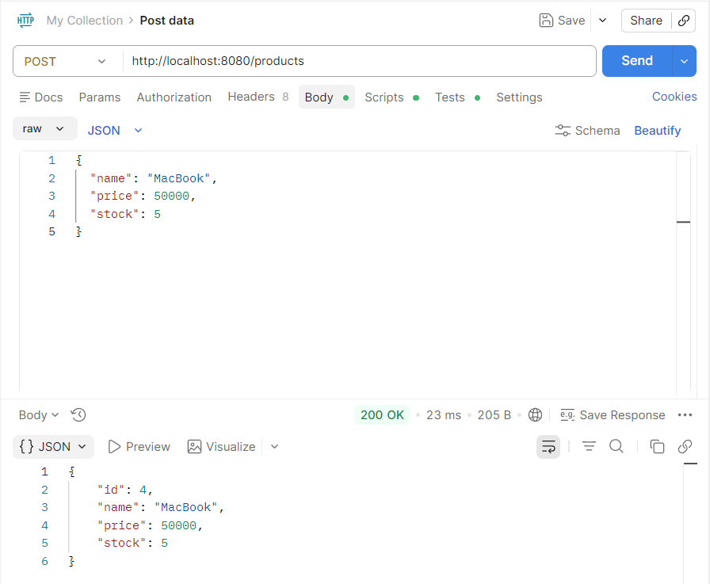
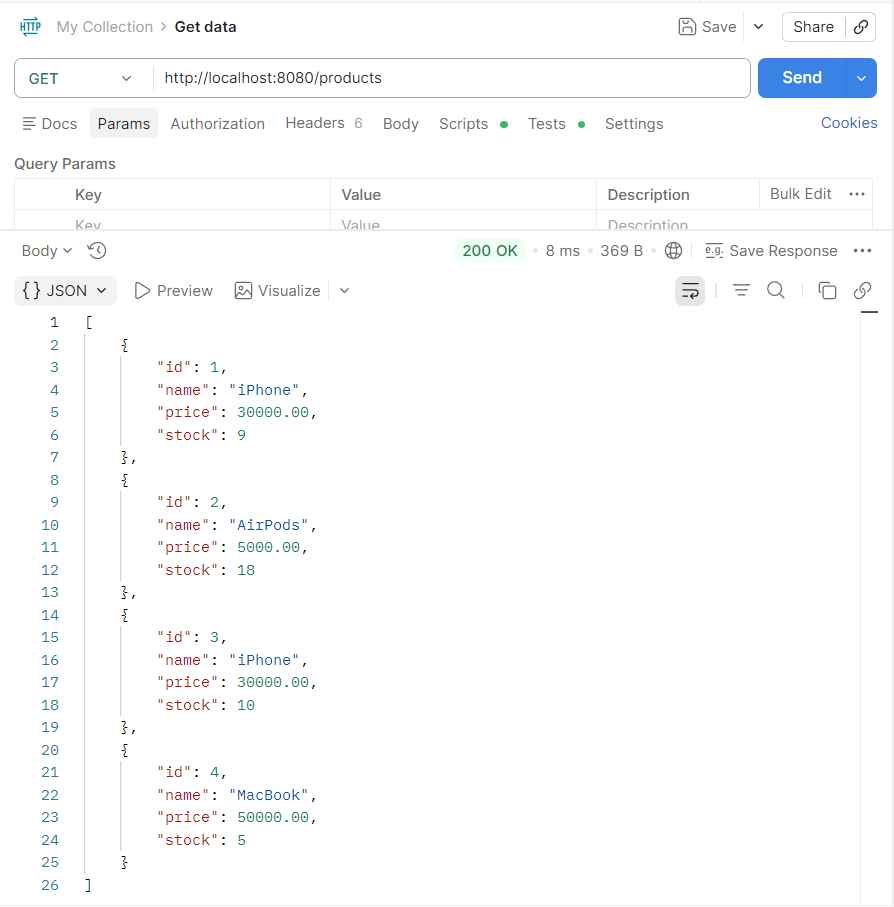
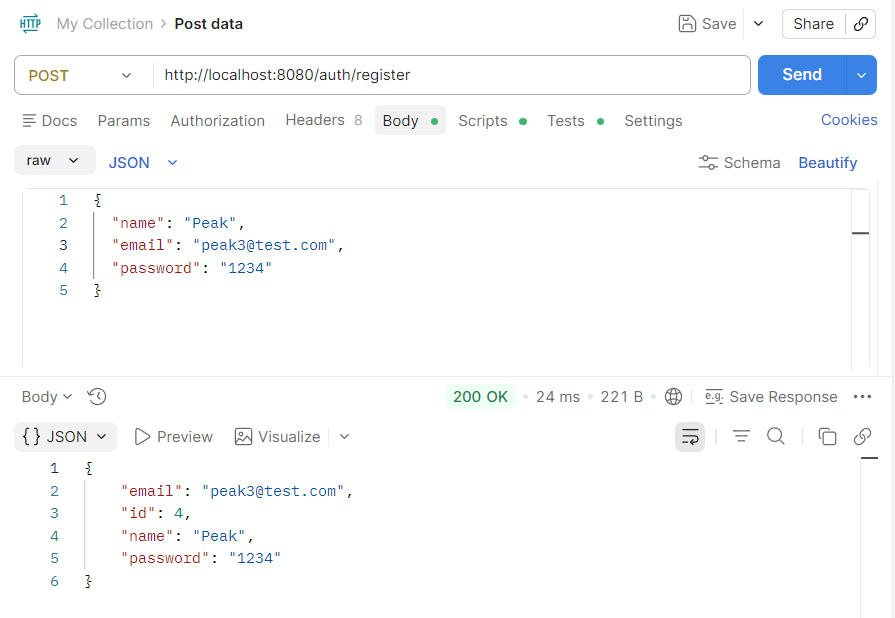
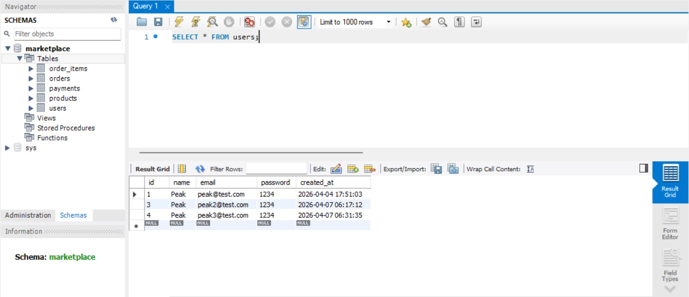

# Marketplace Backend

Backend system for a marketplace application built with Spring Boot.

---

## Tech Stack

* Java 17
* Spring Boot
* Spring Data JPA
* MySQL
* Maven

---

## Features

* User Authentication (Register / Login)
* Product Management
* Cart System
* Order System

---

## API Testing

### Create Product

### Register

---

## Author

Ashira Chansawang
* Email: ashira.peak@gmail.com
* GitHub: https://github.com/Ashira-C
