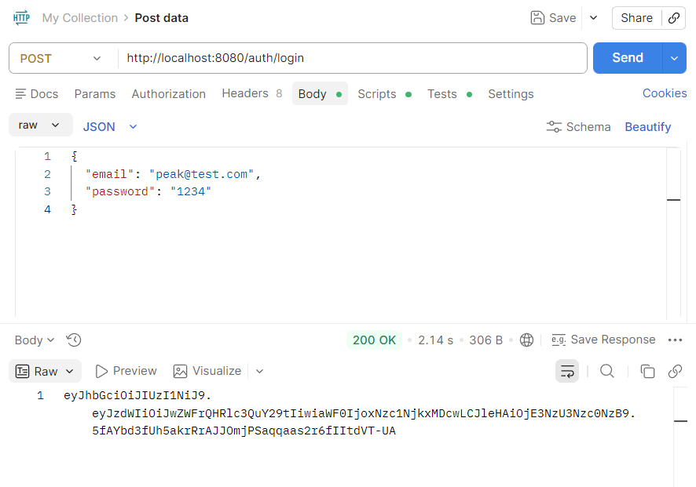

# Marketplace Order & Payment Engine

Backend system for a marketplace application built with Spring Boot.

---

## Tech Stack

* Java 17
* Spring Boot
* Spring Data JPA
* MySQL
* Maven

---

## Features

* JWT Authentication (Register / Login)
* Product Management (CRUD + Stock Handling)
* Order Management System
    - Create Order
    - Calculate Total Price
    - Order Status (PENDING, PAID, CANCELLED)
* Payment Simulation (Mock Payment Flow)
* Transaction Handling (Data Consistency)

---

## System Overview

This system handles:

User → Order → Payment → Database

Flow:
1. User creates order
2. System checks product stock
3. Calculates total price
4. Creates order with PENDING status
5. User performs payment
6. System updates order status to PAID or CANCELLED

---

## How to Run

1. Clone repository
2. Setup MySQL database
3. Update application.properties
4. Run Spring Boot application

Server will start at:
http://localhost:8080

---

## API Testing

### Create Product

### Register

### Login (JWT)

### Get Products
#### Without Token (Unauthorized)
.png)
#### With Token (Authorized)
.png)

---

## Author

Ashira Chansawang
* Email: ashira.peak@gmail.com
* GitHub: https://github.com/Ashira-C
